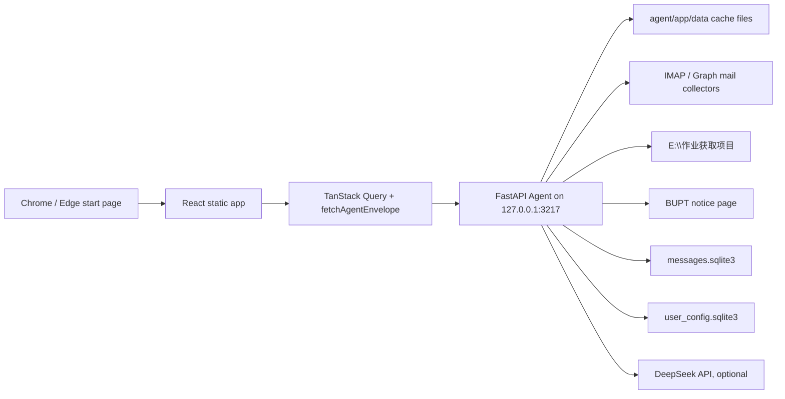

# Architecture

MyPage has two deliberately separate parts:

- a static browser start page in `frontend/`
- a local-only Python Agent in `agent/`

The frontend is optimized for fast personal use. The Agent is the boundary for local files, credentials, mailbox access, scheduled data, and automation scripts.

## High-Level Flow



The browser never receives secrets. It only receives normalized display data through Agent envelopes.

## Frontend

Stack:

- Vite
- React
- TypeScript
- Tailwind CSS
- TanStack Query
- Zustand
- react-grid-layout
- framer-motion
- lucide-react

Important files:

- `frontend/src/App.tsx`: top-level app composition.
- `frontend/src/app/AppShell.tsx`: wallpaper, time, search, settings, widget grid.
- `frontend/src/config/appConfig.ts`: static app configuration, search engines, default widgets.
- `frontend/src/config/types.ts`: widget and config types.
- `frontend/src/config/useEffectiveConfig.ts`: merges user config into static config.
- `frontend/src/store/useConfigStore.ts`: persisted user configuration.
- `frontend/src/store/useLayoutStore.ts`: persisted widget layout.
- `frontend/src/layout/defaultLayouts.ts`: default layout, normalization, restored-widget placement.
- `frontend/src/layout/WidgetGrid.tsx`: draggable/resizable widget grid.
- `frontend/src/widgets/registry.tsx`: maps widget `type` to React component.

### Persistent State

The frontend stores personal UI preferences in `localStorage`:

- `mypage-user-config-v2`: wallpaper, saved wallpapers, quick links, hidden widget ids.
- `mypage-widget-layouts`: react-grid-layout layouts for breakpoints.

These are intentionally client-side and personal, but they are now mirrored to the Agent as a trusted local backup. The browser cache remains the fast path; `agent/app/data/user_config.sqlite3` is the recovery source when a browser profile, origin, or extension context loses state.

### Widget Layout

Default layout comes from each widget's `layout` in `appConfig.ts`.

When a widget is restored from Settings:

1. Settings calls `appendWidgetLayout`.
2. `appendWidgetToLayouts` finds the bottom of currently visible widgets.
3. The restored widget is placed after that bottom.
4. The restored widget keeps its default `w`, `h`, `minW`, and `minH`.

`WidgetGrid` sets `compactType={null}` so the grid does not automatically squeeze restored widgets into old holes.

## Local Agent

Stack:

- Python
- FastAPI
- SQLite for message state
- JSON files for lightweight caches

Important files:

- `agent/app/main.py`: FastAPI app, CORS, background mail sync.
- `agent/app/api/widgets.py`: public local API routes.
- `agent/app/services/cache.py`: envelope and cache file helpers.
- `agent/app/services/message_pipeline.py`: mail collectors, DeepSeek analysis, notification center.
- `agent/app/services/homework.py`: BUPT homework JSON reader and silent manual refresh.
- `agent/app/services/school_notices.py`: BUPT school notice fetch, relevance filtering, dismiss state.
- `agent/app/services/user_config.py`: trusted local backup for user configuration and layout snapshots.
- `agent/app/services/link_icons.py`: link icon resolver, local icon registry, and favicon cache.
- `agent/app/sample_data.py`: fallback sample data.

The Agent binds to `127.0.0.1:3217`. It should not be exposed on a public network.

## Agent Envelope

Every widget endpoint should return:

```json
{
  "updatedAt": "2026-06-24T02:00:00+08:00",
  "stale": false,
  "error": null,
  "data": {}
}
```

The frontend treats `stale` and `error` as display states, not fatal app errors.

## Current API Surface

Basic:

- `GET /health`

Configuration backup:

- `GET /api/config/load`
- `POST /api/config/save`
- `GET /api/config/snapshots`
- `POST /api/config/snapshots/{snapshot_id}/restore`

Static/cache-backed widgets:

- `GET /api/school/today`
- `GET /api/github/contributions`
- `GET /api/codex/usage/today`
- `GET /api/automation/digest`
- `GET /api/scripts/status`

Link icons:

- `GET /api/link-icons/resolve?href=...`
- `POST /api/link-icons/cache`
- `GET /api/link-icons/files/{file_name}`

Homework:

- `GET /api/homework/due`
- `POST /api/homework/refresh`

School notices:

- `GET /api/school/notices`
- `POST /api/school/notices/refresh`
- `POST /api/school/notices/{notice_id}/dismiss`

Mail and notifications:

- `GET /api/mail/summary`
- `POST /api/mail/refresh`
- `POST /api/mail/messages/{message_id}/dismiss`
- `GET /api/notifications`

Microsoft Graph support:

- `GET /api/mail/microsoft/status`
- `POST /api/mail/microsoft/device/start`
- `POST /api/mail/microsoft/device/poll`

## Data Storage

Ignored local runtime data:

- `agent/app/data/mail_accounts.json`
- `agent/app/data/oauth_tokens.json`
- `agent/app/data/messages.sqlite3`
- `agent/app/data/user_config.sqlite3`
- `agent/app/data/link_icons.sqlite3`
- `agent/app/data/link-icons/`
- other `agent/app/data/*.json`

Committed templates:

- `agent/mail_accounts.example.json`
- `agent/.env.example`
- `agent/app/data/.gitkeep`

## External Integrations

### Config Backup

The frontend keeps `localStorage` as a fast cache, but the Agent is the trusted local backup for user data. The backed-up config includes:

- links
- wallpapers
- hidden widget ids
- widget layouts
- sticky note
- selected search engine

`ConfigBackupSync` loads Agent backup at startup. If Agent data is newer, it restores frontend stores. If local data is newer or no Agent backup exists, it saves local data to Agent. Later changes are saved back to Agent with a short debounce.

The Agent stores the current config in `user_config.sqlite3` and snapshots previous versions before each save. The Settings Backup tab can export, import, refresh status, and restore the latest snapshot.

### Link Icons

Quick links store only user intent:

- `id`
- `label`
- `href`
- `category`

They do not store favicon URLs. Icons are derived cache data owned by the Agent.

The frontend renders icons through a stable URL:

```txt
/api/link-icons/resolve?href=https%3A%2F%2Fexample.com
```

The Agent normalizes the link host, looks up `agent/app/data/link_icons.sqlite3`, and returns the cached image file from `agent/app/data/link-icons/`. If there is no cached icon, the Agent fetches one, validates that the response is actually an image, stores it locally, records the registry row, and returns the image. If fetching fails and a previous icon exists, the previous icon stays in use. If no icon exists, the Agent generates a local fallback SVG.

This keeps user config stable when an icon changes from `.ico` to `.png` or when a site changes favicon paths. Do not add `icon`, `favicon`, or concrete `/api/link-icons/files/...` URLs back into `QuickLink` or config backup.

### Mail

QQ IMAP is the working default. Outlook can be represented by forwarding Outlook mail into QQ and configuring forwarded source detection. Microsoft Graph device-code support exists, but is not required for the current setup.

Mail analysis:

- DeepSeek analyzes new messages when `DEEPSEEK_API_KEY` is present.
- A local keyword fallback keeps the UI usable without DeepSeek.
- Low-signal mail, read mail, and manually dismissed mail are hidden from the Mail widget.
- Important mail is copied into the shared notification center.

### Homework

Homework data is read from `E:\作业获取项目\homework_db.json` by default.

Manual refresh uses a silent inline wrapper around the homework project's core functions. It updates the local state file but does not call the homework project's `Notifier`, so it does not send email, desktop notifications, markdown, webhook, WeChat, or PushPlus messages.

### School Notices

School notices are fetched from the BUPT portal notice list. This is separate from the ucloud homework API: `E:\作业获取项目\valid_headers.json` contains `blade-auth` / `authorization` headers for homework requests and cannot directly authenticate `my.bupt.edu.cn`.

The Agent stores portal cookies in `agent/app/data/school_portal_cookies.json`. When those cookies are missing or expired, the current implementation reuses the homework project's login-form helper and Playwright to log into the BUPT portal and capture a fresh `JSESSIONID`.

The service parses notice links, extracts dates and detail text, scores relevance for student-facing notices, hides low relevance items, and stores dismiss state locally under `agent/app/data/`.

## Extension Mode

The frontend can be built and loaded as an unpacked Chrome/Edge extension. Dynamic widgets still depend on the local Agent at `127.0.0.1:3217`; without the Agent, widgets show unavailable or sample states while the static page remains usable.
